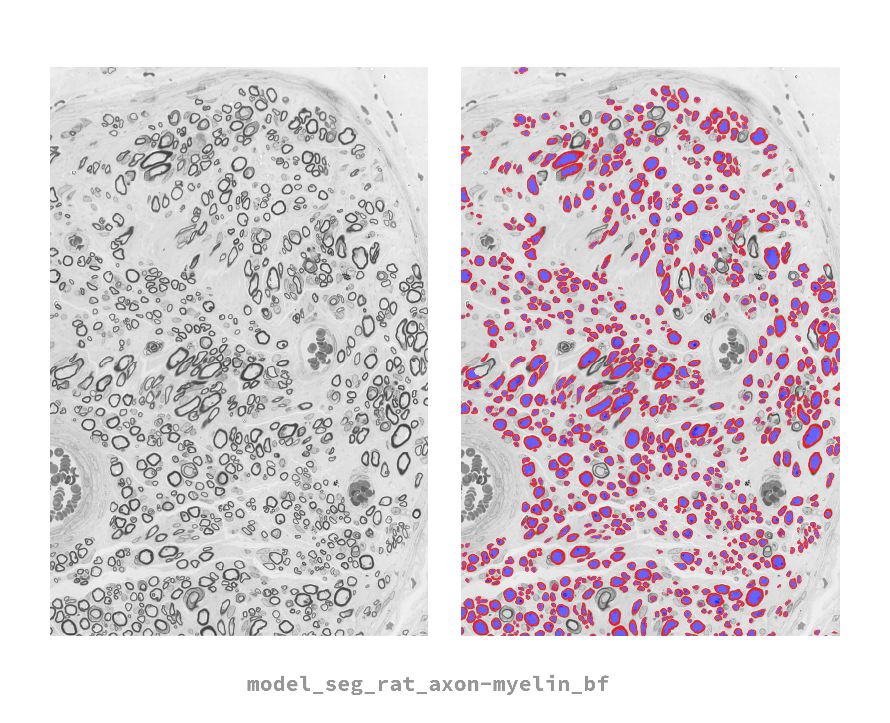

# model_seg_rat_axon-myelin_bf
---
## Model overview

Default Bright-Field (BF) optical microscopy model that works at a resolution of 0.1 micrometer per pixel.

## Dependencies
- [ivadomed](https://ivadomed.org/) commit: e6554281d07b5afef9e68ce8b02e86b02bd68363
- [axondeepseg](https://axondeepseg.readthedocs.io/en/latest/) commit: 805868e39eddf620c9f3d60d313cadffb1121bfb

## Segment (ADS)
To segment an image using this model, use
```
axondeepseg -t BF -i <IMG_PATH> -m <path_to_model_folder> -s <PIXEL_SIZE>
```
The `-m` option can be omitted in this case because this is a default built-in model.


## Train and test (ivadomed)

### Clone this repository
In order to train this model, you will need the json configuration file located in this repo.
```
git clone https://github.com/axondeepseg/default-BF-model
```

### Get the data
- git@data.neuro.polymtl.ca:datasets/data_axondeepseg_bf_training
- commit f833b905c2cb221d45b2ef5ac2fad1100e70b410

```
git clone git@data.neuro.polymtl.ca:datasets/data_axondeepseg_bf_training
cd dataset-used-to-train-the-model
git annex get .
```

### Train this model
To train the model, please first update the following fields in the training config file:
- `fname_split`: full path to the split_dataset.joblib file
- `path_data`: full path to training data
- `gpu_ids`: specific to your hardware
- `path_output`: where the model will be saved
- `bids_config`: full path to the custom bids config located in `ivadomed/config/config_bids.json`

Then, you can train the model with
```
ivadomed --train -c path_to_config_file.json
```

### Test this model
To test the model, use
```
ivadomed --test -c path_to_config_file.json
```
